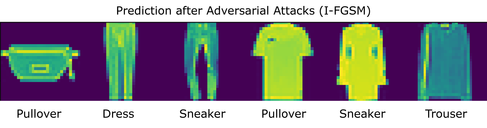

# Smart Cybersecurity Project

Welcome to the Smart Cybersecurity Project repository! This collection of Jupyter notebooks showcases my work in implementing, training, and fine-tuning various proof-of-concept machine learning models to address cybersecurity challenges. The projects cover a range of topics including adversarial attacks and defenses, network intrusion detection, and malware detection in documents.

## Overview

This repository contains implementations of machine learning models designed to tackle specific cybersecurity issues. The models used include SVM, Random Forests, Gradient Boosting and Local Outlier Factor, among others. Feature extraction techniques such as Bag-of-Words and PCA are also utilized.

This project is part of the SmartLab competition organized by Prof. Konrad Rieck, from the BIFOLD (Berlin Institute for the Foundations of Learning and Data).
After 6 months of work, my duo and I won the competition!
Each notebook is self-contained and focuses on a specific cybersecurity problem, as listed below.

## Projects

### 1. Spam Filtering
- **Description**: Filtering spam through parsing, Bag-of-Words, and SVM with cross-validation.
- **Notebooks**:
  - `unit1-spam-classifier-1.ipynb`
  - `unit1-spam-classifier-2.ipynb`

### 2. Malware in Documents
- **Description**: Detecting malware in various document formats (.pdf, .docx, .rtf) using Bag-of-Words and models like SVM, Decision Tree, Random Forest, and Gradient Boosting.
- **Notebooks**:
  - `unit2-docx-gb-n3-warm.ipynb`
  - `unit2-pdf.ipynb`
  - `unit2-rtf-gb-n2-df1.ipynb`

### 3. Malware Clustering
- **Description**: Clustering malware using Bag-of-Words, K-means/DBSCAN, and evaluating with Silhouette score.
- **Notebook**: `unit3-web.ipynb`

### 4. Website Fingerprinting
- **Description**: Identifying websites using Bag-of-Words, PCA, and models like One-Class SVM, Isolation Forest, and Local Outlier Factor.
- **Notebook**: `unit4-fingerprint2.ipynb`

### 5. Network Intrusion Detection
- **Description**: Detecting network intrusions with Bag-of-Words, PCA, and models such as One-Class SVM, Isolation Forest, and LOF, with thresholding based on anomaly scores.
- **Notebook**: `unit5-network-intrusion.ipynb`

### 6. Adversarial Machine Learning
#### 6a. Adversarial Machine Learning Attack
- **Description**: Implementation of a surrogate CNN for model stealing and FGSM attack for evasion.
- **Notebook**: `unit6a.ipynb`

#### 6b. Adversarial Machine Learning Defense
- **Description**: Techniques to improve robustness to I-FGSM attacks included in the training process.
- **Notebook**: `unit6b - Adversarial ML (defense).ipynb`

___
Thank you for visiting my repository! I hope you find the projects insightful and informative.
